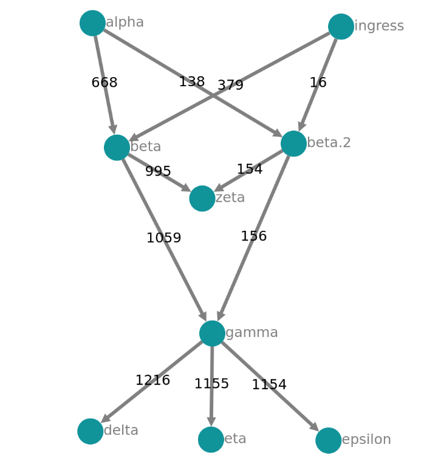

 Bent [](https://goreportcard.com/report/github.com/moolen/bent) [](https://travis-ci.com/moolen/bent)
 ====

Run a Service Mesh on top of AWS Fargate containers.

## What's the point?

This implementation is a PoC on how to deploy a envoy-based service mesh on top of `AWS FARGATE`. I know, there's App Mesh, but it's not yet released in all regions (can i haz eu-central plx?) and it's bleeding edge. I wanted to experiment and see how to build a service mesh on my own (see limitations below).

For my own sanity aswell as my wallet, this thingy also runs locally leveraging [docker-compose](https://github.com/moolen/bent/blob/master/example/compose/docker-compose.yml). See `Playground` below.

## Installation

There's a [terraform example](./deploy) to bootstrap the AWS infrastructure.
You may also want to take a look at the [docker-compose](https://github.com/moolen/bent/blob/master/example/compose/docker-compose.yml) example.

### Building from source

```bash
$ make test
$ make build
```

### Playground



```bash
$ docker-compose up -f ./example/compose/docker-compose.yml -d
```
Open the jaeger dashboard at [http://localhost:16686](http://localhost:16686) in your browser. There's a traffic-generator built-in.
Just change the annotations in the `config.yaml`. They are reloaded at runtime.

The front proxy is HTTP Basic auth protected

```bash
$ export http_proxy=http://localhost:4100 # points to "ingress"
$ curl beta.svc # 401
$ curl jimmy:1234@beta.svc
```

A lot of features are built into this implementation:

- configurable health checking
- configurable circuit breaking
- authz HTTP Basic Auth front-proxy
- endpoint weights
- json access logs
- native open tracing integration (jaeger)
- prometheus endpoint (`0.0.0.0:15090/stats/prometheus`)
- configurable fault injection

## Concepts

Bent makes assumptions about the way services are running and how they interact with each other. These concepts were initially tailored towards services running on `AWS Fargate`.

### Service Mesh
All ECS FARGATE **tasks** are meshed. All ingress and egress traffic flows through the sidecar.

Example:

app1 talks to app2. The traffic flows first to the local sidecar, then to the remote sidecar and finally to `app2`.

```
+---------+               +---------+
|         |               |         |
|  envoy  +--------------->  envoy  |
|         |               |         |
+----^----+               +----+----+
     |                         |
+----+----+               +----v----+
|         |               |         |
|  app1   |               |  app2   |
|         |               |         |
+---------+               +---------+
```

* the envoy-sidecar listens on a well-known port (4000) for egress traffic
* the envoy-sidecar listens on a well-known port (4100) for inress traffic

### Egress Traffic

The egress traffic originating from an application container **MUST** be proxied through the envoy sidecard using the `HTTP_PROXY` semantics. Many runtimes (e.g. go, nodejs, bash/curl) make use of environment variables. The Egress traffic will then go to

```bash
$ export http_proxy="http://localhost:4000"
$ curl foo.svc
```

Envoy has `ALL THE ROUTES` of all other services on the egress listener (:4000). These routes point to the sidecar.

### Ingress Traffic
For every service in a task there is a route in the ingress listener chain (:4100). Requests are being forwarded based on the `Host` header.


### Limitations / NYI
* apps have to use either `HTTP_PROXY` or specify the `Host` when talking to the egress envoy listener. It is not possible to do iptables wizardry and redirect the traffic to envoy
* High Availability: the cluster/endpoint state is not being persistet yet
* High Availability: no clustering mechanisms implemented yet

## Discovery Mechanisms

Bent supports two discovery mechanisms: `file` and `aws fargate`.

### AWS Fargate

The controlplane depends on the [well-known AWS environment variables](https://docs.aws.amazon.com/cli/latest/userguide/cli-configure-envvars.html).

Bent's abstraction of endpoints and services is a different one than the one AWS Fargate makes.

* it doesn't care about "ECS services"
* all (ecs) tasks are equal
* a task may expose multiple endpoints
* tasks use dockerLabels to configure the sidecar

Example schema of a ecs task-definition:

```yaml
- name: sidecar
  image: moolen/bent-envoy:latest
  environment:
  - name: ENVOY_XDS_HOST
    value: my.controlplane

- name: echo
  image: jmalloc/echo-server
  environment:
  - name: PORT
    value: '3000'
  dockerLabels:
    # traffic to "echo.alpha" is being forwarded to container "echo" / port 3000
    envoy.service.echo.alpha: echo:3000
    envoy.service.echo.alpha.annotations.enable-retry: ''
    envoy.service.echo.alpha.annotations.num-retries: '3'
    envoy.service.echo.alpha.annotations.healthcheck.path: "/gimme-healthz"
```


### File-based

Specify a configuration in the following format and launch Bent with `-provider file` and `-config path/to/config.yaml`. Bent will continuously read the file and change the envoy configuration.

```yaml
# services are a global collection of endpoints
# the "local" service which is being sidecar-ed is defined below at "nodes"
services:
- name: "beta.svc"
  annotations:
    fault.inject: ""
    fault.delay.duration: "150"
    fault.delay.percent: "10"
    fault.abort.code: "501"
    fault.abort.percent: "5"
  endpoints:
  - address: 10.123.0.22
    port: 4100
- name: "gamma.svc"
  endpoints:
  - address: 10.123.0.24
    port: 4100

# these are the "local" services which are being sidecar-ed
nodes:

  alpha:
    # alpha node does not expose endpoints

  beta:
    # incoming requests that match beta.svc
    # are being forwarded to 10.123.0.23:3000
    # a node may specify multiple services
    - name: "beta.svc"
      endpoints:
      - address: 10.123.0.23
        port: 3000

  gamma:
    - name: "gamma.svc"
      endpoints:
      - address: 10.123.0.25
        port: 3000

```

## Annotations

On Fargate, use dockerLabels to specify annotations. The annotations must follow the schema:

* `envoy.service.<service-name>.annotations.<annotation>`

If you want to specify the health-check path for your `echo.alpha` service, use this label: `envoy.service.echo.alpha.annotations.healthcheck.path: "/gimme-healthz"`


Here's a list of all Annotations:

```go
	// ------
	// cluster level annotations
	// ------

	// AnnotationHealthCheckPath specifies the HTTP Path for health-checks
	AnnotationHealthCheckPath = "healthcheck.path"
	// AnnotationHealthInterval specifies the health check interval in milliseconds
	AnnotationHealthInterval = "healthcheck.interval"
	// AnnotationHealthCacheDuration specifies the health check cache duration in milliseconds
	AnnotationHealthCacheDuration = "healthcheck.cache"
	// AnnotationHealthTimeout specifies the timeout of a health-check in milliseconds
	AnnotationHealthTimeout = "healthcheck.timeout"
	// AnnotationHealthPort specifies the tcp port for the health-check
	AnnotationHealthPort = "healthcheck.port"
	// AnnotationHealthExpectedStatus specifies the accepted status codes
	AnnotationHealthExpectedStatus = "healthcheck.expected-status"

	// AnnotaionCBMaxConn sets the maximum number of connections that Envoy will make to the upstream
	AnnotaionCBMaxConn = "circuit-breaker.max-connections"
	// AnnotaionCBMaxPending sets the maximum number of pending requests that Envoy will
	// allow to the upstream cluster
	AnnotaionCBMaxPending = "circuit-breaker.max-pending"
	// AnnotaionCBMaxRequests sets the maximum number of parallel requests
	AnnotaionCBMaxRequests = "circuit-breaker.max-requests"
	// AnnotaionCBMaxRetries sets maximum number of parallel retries that Envoy
	// will allow to the upstream cluster
	AnnotaionCBMaxRetries = "circuit-breaker.max-retries"

	// ------
	// endpoint level annotations
	// ------

	// AnnotaionEndpointWeight specifies the loadbalancer weight of the endpoint
	AnnotaionEndpointWeight = "endpoint.weight"

	// ------
	// listener level annotations
	// ------

	// AnnotaionFaultInject enables fault injection
	AnnotaionFaultInject = "fault.inject"
	// AnnotaionFaultDelayPercent int value, specifies the delay injection percentage
	AnnotaionFaultDelayPercent = "fault.delay.percent"
	// AnnotaionFaultDelayDuration in milliseconds
	AnnotaionFaultDelayDuration = "fault.delay.duration"
	// AnnotaionFaultAbortPercent int value, specifies the abort injection percentage
	AnnotaionFaultAbortPercent = "fault.abort.percent"
	// AnnotaionFaultAbortCode specify the response status code
	AnnotaionFaultAbortCode = "fault.abort.code"
```
